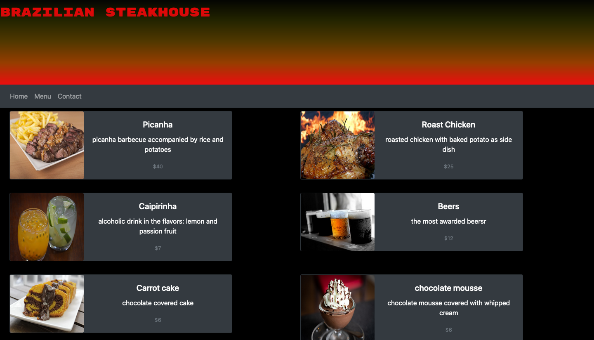

# restaurant_page-js

> This is a responsive Restaurant page builded with entire JavaScript.

## Feature

- NavBar with links to the pages: Home, Menu and Contact.



## Built With

- JavaScript
- Node.js
- Webpack
- Babel
- Bootstrap 4
- SCSS
- HTML

## Live Demo

- You can click on this [link](https://raw.githack.com/brugobi/restaurant_page-js/feature/dist/index.html)

## Getting Started

### Prerequisites

- Node.js
- Any Browser

To get started open the directory where you will save this repo by typing on your terminal:

```
$ cd <directory>
```

- Clone the repo typing:

```
$ git clone git@github.com:brugobi/restaurant_page-js.git
```

- Install dependencies:

```
$ npm install
```

### Usage

Start the server:

```
$ npm run server
```

Open `http://localhost:3000/` in your browser.

## Author

👤 **Bruna Gobi**

- Github: [@brugobi](https://github.com/brugobi)
- Twitter: [@BrunaGobi2](https://twitter.com/BrunaGobi2)
- Linkedin: [bruna-gobi](https://www.linkedin.com/in/bruna-gobi/)

## 🤝 Contributing

Contributions, issues and feature requests are welcome!

## Show your support

Give a ⭐️ if you like this project!
Feel free to check the [issues page](issues/).

## Acknowledgments

- Project requested by [Microverse Program](https://www.microverse.org/).
- All the images were taken from [Pixabay](https://pixabay.com/pt/).

## 📝 License

This project is [MIT](lic.url) licensed.
